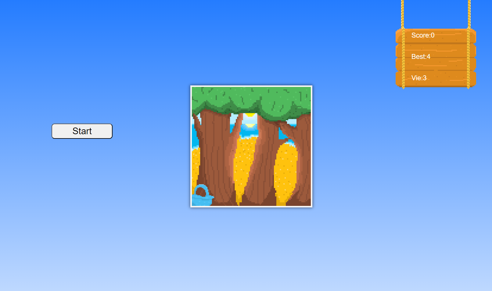
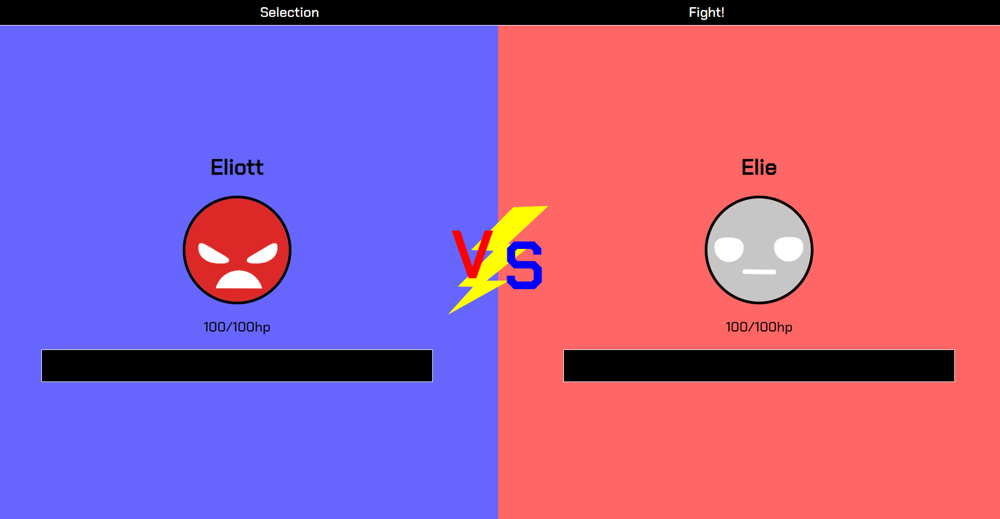
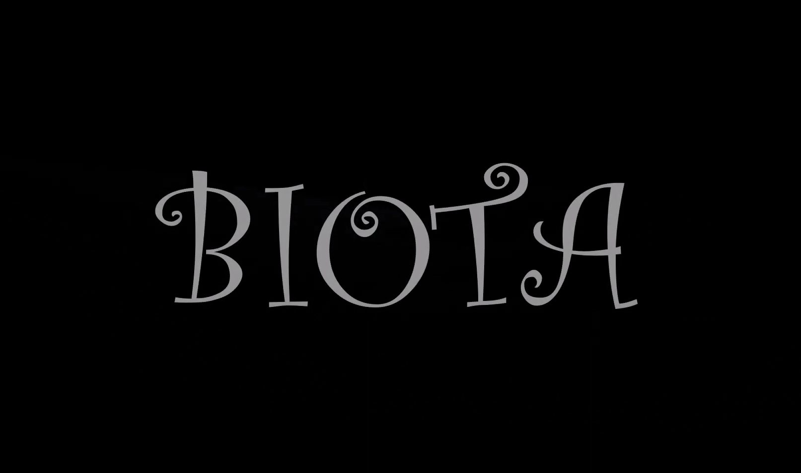
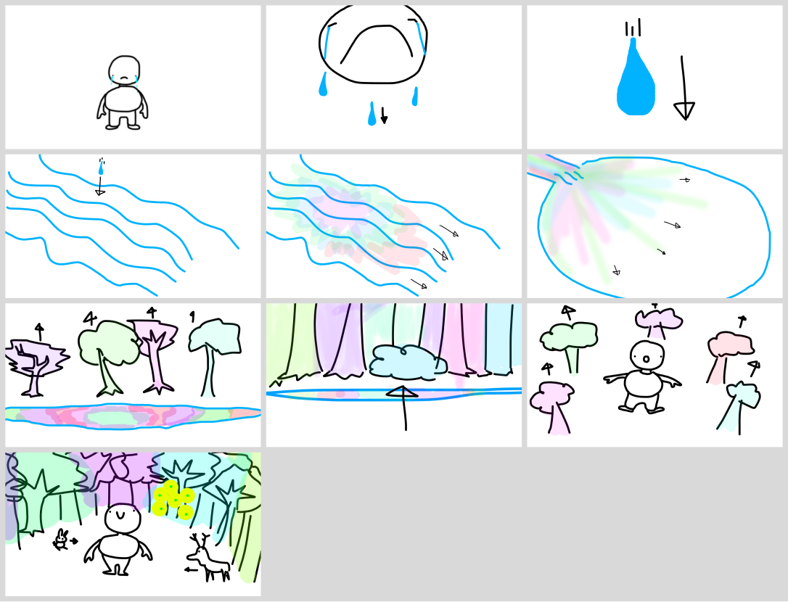
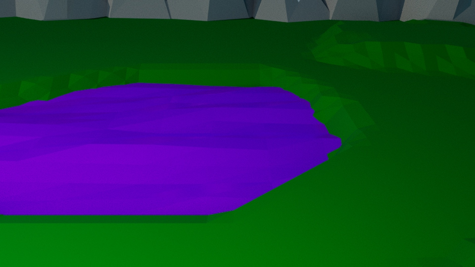
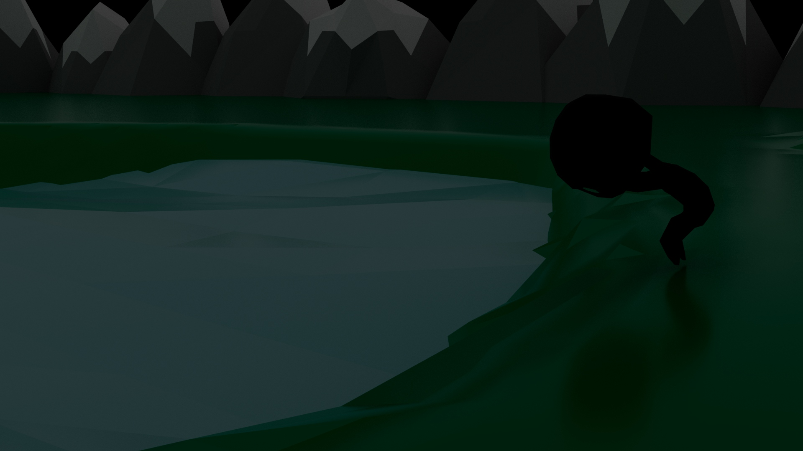

# Portfolio

## Coordonnée
- Étienne Charron
- iticharron@icloud.com
- 438-506-7431
- 661 rue Bellevue Deux-Montagnes

## Objectif
J'aime la programation et le design web, je suis alaise avec HTML, Javascript, Css et le Scss. Je suis aussi a l'aise avec d'autre logiciel de création comme Maya VCV Rack, Figma et Davinci Resolve. Dans le future j'ai comme rêve de crée des jeu vidéo.  

## Projets

### Cueillette de pommes

[lien vers github](https://github.com/etennecharron/jeu_cueillette_pommes)
#### Description
Cueillette de pommes est un jeu web où le but est de récolter le plus de pommes qui tombes des arbres possibles et d'éviter d'en raté 3 sinon la partie est terminé. J'ai tout réaliser dams le projet.
#### Logiciels utilisé
- Visual Studio Code
- Pixelart

### Combat automatique

[lien vers github](https://github.com/etennecharron/combat_automatique)
#### Déscription
Combat automatique est un jeu web où le but est de faire combatre des personnages aléatoir l'un comme l'autre. J'ai tout réaliser dans le projet.
#### Logiciels utilisé
- Visual Studio Code
- Figma

### BIOTA

#### Étapes

#### Description
BITOA est un projet réaliser dans le cadre d'un cours d'animation 3D et de conception sonor. L'histoire d'une créature a forme humanoïde triste et seul. Sa tristesse fait naître la vie et redonne de la couleur à son mond. J'ai réaliser le montage vidéo, les sons, la modélisation du personnage et son animation.
#### Logiciels utilisé
- Maya
- Reaper
- VCV Rack
- Davinci Resolve
 

